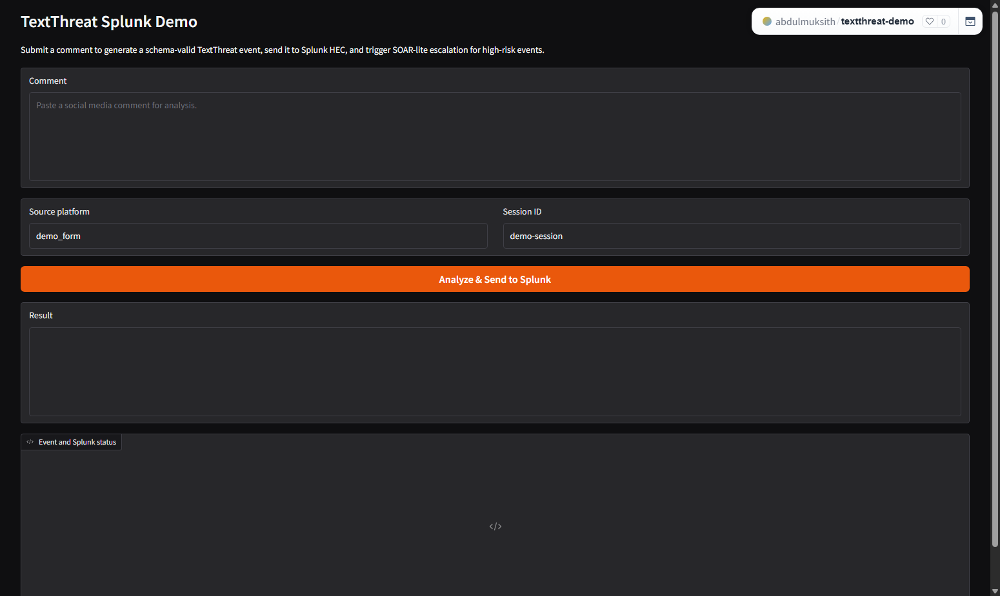
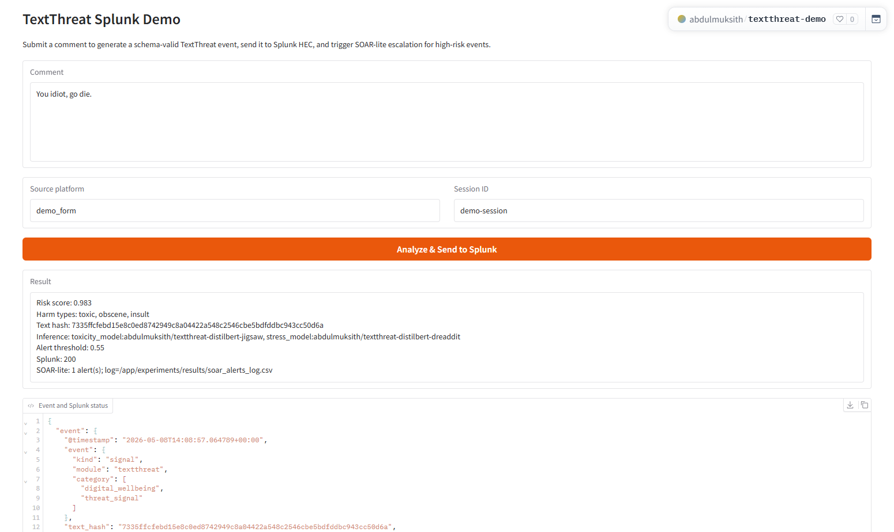
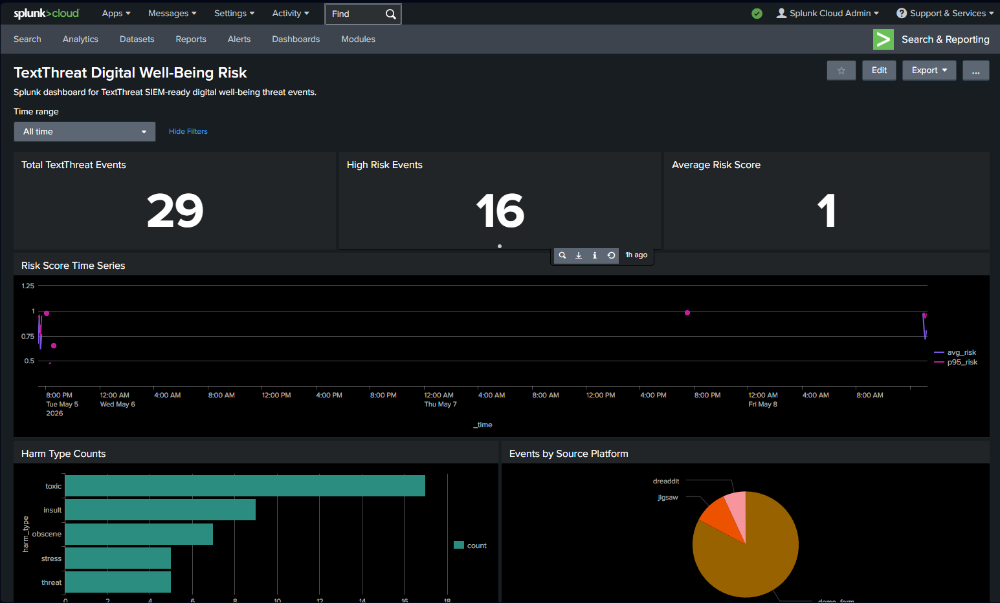
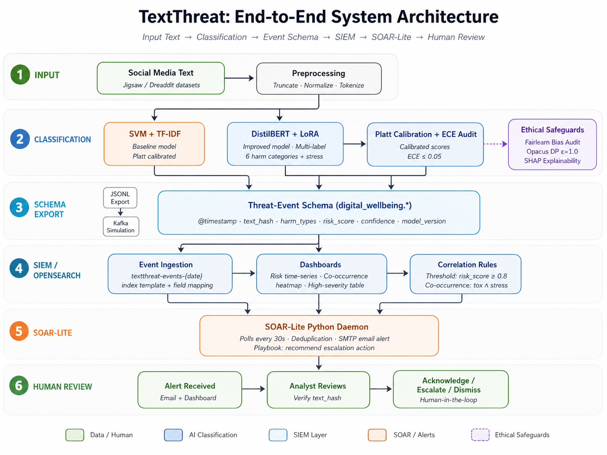

# TextThreat

**TextThreat - AI-Powered Detection of Digital Well-Being Risks with Cybersecurity Analytics**

TextThreat is an MSc thesis proof-of-concept that detects digital well-being risk signals from social-media-style text, converts model output into a SIEM-ready JSON event, sends the event to Splunk Cloud, and triggers a lightweight SOAR-style escalation path.

The hosted demo is intentionally simple and reproducible:

```text
Hugging Face Space / Gradio UI
-> submit comment
-> TextThreat model inference
-> ECS-style TextThreat JSON event
-> Splunk HEC ingestion
-> Splunk Cloud dashboard
-> inline SOAR-lite escalation
-> CSV alert log and optional Postmark email
```

## Live Links

| Component | Location |
|---|---|
| GitHub repository | https://github.com/abdulmuksith3/textthreat-poc |
| Hosted demo UI | https://huggingface.co/spaces/abdulmuksith/textthreat-demo |
| Jigsaw harm model | https://huggingface.co/abdulmuksith/textthreat-distilbert-jigsaw |
| Dreaddit stress model | https://huggingface.co/abdulmuksith/textthreat-distilbert-dreaddit |
| Splunk dashboard | Private Splunk Cloud tenant, index `textthreat` |
| SOAR-lite email provider | Postmark HTTPS API fallback, configured through Space secrets |

## Demo Screenshots

### Hosted Hugging Face Demo

This is the public Gradio app hosted on Hugging Face Spaces.



### Submitted High-Risk Comment

This shows a high-risk comment being scored, exported as a JSON event, sent to Splunk, and escalated by SOAR-lite.



### Splunk Dashboard

The Splunk dashboard is private to the configured Splunk Cloud tenant. After importing [textthreat_dashboard.xml](siem/splunk/textthreat_dashboard.xml), it should show:

- `Total TextThreat Events`
- `High Risk Events`
- `Average Risk Score`
- `Risk Score Time Series`
- `Harm Type Counts`
- `Events by Source Platform`
- `Latest Submitted Events`
- `Co-occurrence Candidates`



The dashboard screenshot from the demo session corresponds to this imported dashboard and uses `index=textthreat`.

## What The Demo Proves

The live hosted demo proves the thesis pipeline end to end:

| Thesis / system component | Implemented by |
|---|---|
| Social media text input | Gradio UI in [demo/app.py](demo/app.py) |
| Jigsaw multi-label harm detection | `abdulmuksith/textthreat-distilbert-jigsaw` |
| Dreaddit stress detection | `abdulmuksith/textthreat-distilbert-dreaddit` |
| Event schema | [schema/textthreat_event_schema.json](schema/textthreat_event_schema.json), [schema.py](src/textthreat/schema.py) |
| Splunk ingestion | [splunk_hec.py](src/textthreat/splunk_hec.py) |
| Splunk dashboard | [siem/splunk/textthreat_dashboard.xml](siem/splunk/textthreat_dashboard.xml) |
| SOAR-lite escalation | [soar_lite.py](soar_lite/soar_lite.py) |
| Alert log | `experiments/results/soar_alerts_log.csv` |
| Optional email dispatch | Postmark HTTPS API fallback from [soar_lite.py](soar_lite/soar_lite.py) |
| Reproducible scripts | `scripts/`, `src/textthreat/`, `experiments/results/` |

## Repository Structure

```text
textthreat-poc/
├── app.py                              # Hugging Face Spaces entrypoint
├── Dockerfile                          # Root container entrypoint for local hosting
├── environment.yml                     # Conda reproduction environment
├── README.md                           # This reproduction guide
├── requirements.txt                    # Python dependencies
├── config/
│   ├── settings.example.env            # Safe runtime config template
│   └── settings.env                    # Local secrets file, ignored by Git
├── data/
│   ├── exports/                        # NDJSON event exports
│   ├── jigsaw/                         # Put Jigsaw CSVs here locally
│   ├── dreaddit/                       # Put Dreaddit CSVs here locally
│   └── synthetic/                      # Synthetic co-occurrence sessions
├── demo/
│   └── app.py                          # Gradio UI and live demo workflow
├── docs/
│   └── screenshots/                    # README screenshots
├── experiments/
│   └── results/                        # JSON/CSV evidence artifacts
├── models/
│   ├── distilbert_jigsaw/              # Local lightweight metadata/tokenizer files
│   ├── distilbert_dreaddit/            # Local lightweight metadata/tokenizer files
│   └── svm_tfidf/                      # Classical SVM baseline artifacts
├── notebooks/
│   └── TextThreat_Colab_Training_All.ipynb
├── schema/
│   └── textthreat_event_schema.json    # JSON Schema Draft 7 event validation
├── scripts/
│   ├── smoke_test.py                   # Fast local verification
│   ├── generate_sample_events.py       # Writes sample NDJSON events
│   ├── setup_splunk_demo.py            # Sends sample events / optional setup helper
│   ├── check_model_artifacts.py        # Checks model folder completeness
│   └── upload_models_to_hf.py          # Optional model upload helper
├── siem/
│   └── splunk/                         # SPL queries, saved searches, and dashboard XML
├── soar_lite/
│   ├── soar_lite.py                    # Inline SOAR-lite + optional poller
│   ├── playbook.yml                    # Escalation recommendations
│   └── README.md
└── src/textthreat/
    ├── inference.py                    # Runtime model loading and scoring
    ├── schema.py                       # Event construction and validation
    ├── splunk_hec.py                   # Splunk HTTP Event Collector client
    ├── train_svm.py                    # SVM + TF-IDF baseline
    ├── train_distilbert.py             # DistilBERT Jigsaw/Dreaddit training
    ├── evaluate.py                     # Classification metrics
    ├── calibration.py                  # ECE calculations
    ├── latency.py                      # Sample and real model latency profiling
    ├── dp_output.py                    # Output-level privacy perturbation
    ├── fairness.py                     # Fairlearn audit/demo mode
    ├── explainability.py               # SHAP text attribution summaries
    └── cooccurrence.py                 # Synthetic co-occurrence evaluation
```

## Runtime Architecture

The architecture below shows how the thesis components connect from input text and model classification through schema export, Splunk SIEM analytics, SOAR-lite escalation, and human review.



## Event Schema Summary

Every live event follows the TextThreat JSON schema and includes:

```json
{
  "@timestamp": "2026-05-08T13:54:50.313824+00:00",
  "event": {
    "kind": "signal",
    "module": "textthreat",
    "category": ["digital_wellbeing", "threat_signal"]
  },
  "text_hash": "sha256 hash of raw text",
  "digital_wellbeing": {
    "harm_types": ["toxic", "obscene", "insult"],
    "risk_score": 0.982702,
    "confidence": 0.982702,
    "model_version": "distilbert-jigsaw-v1",
    "scores": {
      "toxic": 0.982702,
      "severe_toxic": 0.184931,
      "obscene": 0.811199,
      "threat": 0.097398,
      "insult": 0.887944,
      "identity_hate": 0.119561,
      "stress": 0.526596
    }
  },
  "source_platform": "demo_form",
  "session_id": "demo-session"
}
```

Raw comment text is not exported to Splunk. The event stores `text_hash` for analyst lookup and reproducibility without storing the original text.

## Reproduction Guide

Use the path that matches what you want to verify. The paths build on each other, but you do not need to run all of them for a simple demo.

| Path | Goal | Time | Needs datasets? | Needs Splunk? |
|---|---|---:|---|---|
| A | Verify the repo locally with sample artifacts | 2-5 min | No | No |
| B | Run the Gradio demo locally | 5-10 min | No | Optional |
| C | Reproduce the hosted demo with Splunk | 15-30 min | No | Yes |
| D | Set up or verify the Splunk dashboard | 10-20 min | No | Yes |
| E | Retrain thesis models | GPU hours | Yes | No |
| F | Generate final thesis evidence artifacts | Varies | Optional | Optional |

### Path A: Fast Local Verification

This path proves the repository is installed correctly and can generate schema-valid sample artifacts.

1. Clone the repository.

```bash
git clone https://github.com/abdulmuksith3/textthreat-poc.git
cd textthreat-poc
```

2. Create a Python environment.

Windows PowerShell:

```powershell
python -m venv .venv
.\.venv\Scripts\Activate.ps1
python -m pip install --upgrade pip
pip install -r requirements.txt
```

macOS/Linux:

```bash
python -m venv .venv
source .venv/bin/activate
python -m pip install --upgrade pip
pip install -r requirements.txt
```

3. Run the smoke test.

```bash
python scripts/smoke_test.py
```

Expected final line:

```text
TextThreat smoke test passed.
```

The smoke test creates or refreshes these sample artifacts:

```text
data/exports/sample_textthreat_events.ndjson
experiments/results/classification_metrics.json
experiments/results/latency_metrics.json
experiments/results/dp_results.json
experiments/results/fairness_results.json
experiments/results/cooccurrence_results.json
experiments/results/soar_alerts_log.csv
```

### Path B: Local Demo

This path runs the same Gradio app used by the hosted Hugging Face Space.

1. Create a local environment file.

```powershell
Copy-Item config\settings.example.env config\settings.env
```

`config/settings.env` is ignored by Git. Put local secrets there only.

2. Add the minimum demo settings.

```env
TEXTTHREAT_TOXICITY_MODEL_ID=abdulmuksith/textthreat-distilbert-jigsaw
TEXTTHREAT_STRESS_MODEL_ID=abdulmuksith/textthreat-distilbert-dreaddit
TEXTTHREAT_EVENT_THRESHOLD=0.55
SOAR_LITE_ENABLED=1
SOAR_LITE_THRESHOLD=0.8
```

3. Add Splunk settings if you want local submissions to reach Splunk Cloud.

```env
SPLUNK_HEC_URL=https://<your-stack>.splunkcloud.com:8088/services/collector/event
SPLUNK_HEC_TOKEN=<your-hec-token>
SPLUNK_INDEX=textthreat
SPLUNK_SOURCETYPE=_json
SPLUNK_SOURCE=textthreat-demo
SPLUNK_VERIFY_SSL=true
SPLUNK_HEC_CHANNEL=11111111-1111-4111-8111-111111111111
```

4. Add email settings only if you want SOAR-lite email escalation.

```env
POSTMARK_API_TOKEN=<postmark-server-token>
POSTMARK_MESSAGE_STREAM=outbound
ALERT_TO_EMAIL=<recipient-email>
ALERT_FROM_EMAIL=<verified-postmark-sender-email>
```

5. Start the app.

```bash
python app.py
```

Open:

```text
http://127.0.0.1:7860
```

The first request can take 10-30 seconds because the Hugging Face models are downloaded and warmed up.

### Path C: Hosted Demo With Splunk

This path reproduces the public hosted demo architecture: Hugging Face Space -> model inference -> Splunk HEC -> Splunk dashboard -> inline SOAR-lite.

1. Confirm the Hugging Face Space.

```text
https://huggingface.co/spaces/abdulmuksith/textthreat-demo
```

2. Set Space variables.

```text
TEXTTHREAT_TOXICITY_MODEL_ID=abdulmuksith/textthreat-distilbert-jigsaw
TEXTTHREAT_STRESS_MODEL_ID=abdulmuksith/textthreat-distilbert-dreaddit
TEXTTHREAT_EVENT_THRESHOLD=0.55
```

3. Set Space secrets.

```text
SPLUNK_HEC_URL
SPLUNK_HEC_TOKEN
SPLUNK_INDEX
SPLUNK_SOURCETYPE
SPLUNK_SOURCE
SPLUNK_VERIFY_SSL
SPLUNK_HEC_CHANNEL
SOAR_LITE_ENABLED
SOAR_LITE_THRESHOLD
```

4. Set optional Postmark secrets for email alerts.

```text
POSTMARK_API_TOKEN
POSTMARK_MESSAGE_STREAM
ALERT_TO_EMAIL
ALERT_FROM_EMAIL
```

5. Restart the Space after changing models or secrets.

```text
Space -> Settings -> Restart Space
```

### Path D: Splunk Dashboard Setup

Use this once per Splunk Cloud tenant.

1. Create the Splunk index.

```text
Index name: textthreat
```

2. Create an HTTP Event Collector token.

```text
Settings -> Data Inputs -> HTTP Event Collector -> New Token
Source type: _json
Index: textthreat
```

3. Copy the HEC endpoint into your local env or Hugging Face Space secret.

```text
https://<your-stack>.splunkcloud.com:8088/services/collector/event
```

4. Send sample events from local Python.

```bash
python scripts/setup_splunk_demo.py --events-only
```

5. Confirm events in Splunk.

```spl
index=textthreat event.module=textthreat
| sort - _time
| table _time text_hash source_platform session_id digital_wellbeing.risk_score digital_wellbeing.harm_types{}
```

6. Import the dashboard XML.

```text
siem/splunk/textthreat_dashboard.xml
```

In Splunk Cloud:

```text
Dashboards -> Create New Dashboard -> Classic XML / Source -> paste XML
```

More SPL examples are in [spl_queries.md](siem/splunk/spl_queries.md).

### Path E: Model Training

Training is optional for running the demo because the trained models are already hosted on Hugging Face. Run this path when you need to reproduce model metrics or update model artifacts.

1. Put datasets in the expected local paths.

```text
data/jigsaw/train.csv
data/dreaddit/dreaddit-train.csv
data/dreaddit/dreaddit-test.csv
```

Raw datasets are not committed to Git.

2. Prefer Colab for DistilBERT training.

```text
notebooks/TextThreat_Colab_Training_All.ipynb
Runtime -> Change runtime type -> GPU
QUICK_TEST=True first
QUICK_TEST=False for final evidence run
```

3. Use these final-run notebook settings.

```python
QUICK_TEST = False
USE_LORA = True
RUN_SVM = True
RUN_JIGSAW_DISTILBERT = True
RUN_DREADDIT_DISTILBERT = True
JIGSAW_EPOCHS = 1
DREADDIT_EPOCHS = 1
```

4. Local training commands are also available.

```bash
python -m src.textthreat.train_svm
python -m src.textthreat.train_distilbert --task jigsaw --epochs 1
python -m src.textthreat.train_distilbert --task dreaddit --epochs 1
```

5. Expected training outputs:

```text
models/svm_tfidf/
models/distilbert_jigsaw/
models/distilbert_dreaddit/
experiments/results/svm_metrics.json
experiments/results/distilbert_metrics.json
experiments/results/dreaddit_metrics.json
```

The training scripts implement thesis-aligned preprocessing, iterative stratification, SVM SMOTE on TF-IDF vectors, DistilBERT-LoRA, class-weighted loss, weighted sampling, and Platt calibration.

### Path F: Final Evidence Artifacts

Run these after installation. Use sample mode for quick verification and real mode for final latency evidence.

| Evidence | Command | Output |
|---|---|---|
| Sample event export | `python -m src.textthreat.export_events --sample` | `data/exports/sample_textthreat_events.ndjson` |
| Sample classification metrics | `python -m src.textthreat.evaluate --sample` | `experiments/results/classification_metrics.json` |
| Sample latency | `python -m src.textthreat.latency --sample` | `experiments/results/latency_metrics.json` |
| Real model latency | `python -m src.textthreat.latency --real --iterations 1000` | `experiments/results/latency_metrics.json` |
| Output-level DP | `python -m src.textthreat.dp_output --sample` | `experiments/results/dp_results.json` |
| Fairlearn audit/demo | `python -m src.textthreat.fairness --sample` | `experiments/results/fairness_results.json` |
| Co-occurrence evaluation | `python -m src.textthreat.cooccurrence --sample --count 200` | `experiments/results/cooccurrence_results.json` |
| SHAP summary | `python -m src.textthreat.explainability --sample` | `experiments/results/shap_explainability_summary.json` |
| SOAR-lite demo alerts | `python soar_lite/soar_lite.py --demo` | `experiments/results/soar_alerts_log.csv` |

To write NDJSON and send the same events to Splunk HEC:

```bash
python -m src.textthreat.export_events --sample --send-splunk
```

The DP script is an output-level privacy-preserving perturbation experiment. The co-occurrence evaluation is synthetic and writes `evaluation_type = synthetic_session_windows`.

## SOAR-lite Behavior

SOAR-lite is implemented in [soar_lite.py](soar_lite/soar_lite.py). In the hosted demo it runs inline immediately after a comment is submitted.

```text
comment submitted
-> event built
-> event sent to Splunk
-> SOAR-lite checks risk_score > 0.8
-> alert is logged to CSV
-> optional alert event is written to textthreat_alerts
-> optional Postmark email is sent
```

Co-occurrence alerts check toxicity and stress in the same `session_id` within a 30-minute window. The aggregate alert risk is `max(individual risk) + 0.1`, capped at `1.0`.

To stream SOAR-lite alert records back into Splunk:

```env
SOAR_LITE_STREAM_ALERTS_TO_SPLUNK=true
SPLUNK_ALERTS_INDEX=textthreat_alerts
```

An optional Splunk polling daemon is also available for environments with Splunk search API access:

```bash
python soar_lite/soar_lite.py --poll-splunk --interval 30
python soar_lite/soar_lite.py --poll-splunk --once
```

## Model Details

| Model | Hosted repo | Task | Labels |
|---|---|---|---|
| Jigsaw harm classifier | `abdulmuksith/textthreat-distilbert-jigsaw` | Multi-label toxic comment classification | toxic, severe_toxic, obscene, threat, insult, identity_hate |
| Dreaddit stress classifier | `abdulmuksith/textthreat-distilbert-dreaddit` | Binary stress classification | non-stress, stress |

The demo also applies a transparent lexical overlay for explicit high-risk phrases such as direct threats or self-harm language. The raw model scores remain visible in the JSON output.

## Example Demo Comments

Use these to exercise the demo:

| Comment | Expected behavior |
|---|---|
| `I love this community, everyone here is helpful and kind.` | Low risk, no SOAR alert |
| `You are useless and disgusting, shut up.` | Toxic / insult likely, may or may not exceed SOAR threshold |
| `You idiot, go die.` | High risk, toxic/obscene/insult likely, SOAR alert likely |
| `I swear I will kill you.` | High risk, threat likely, SOAR alert likely |
| `I feel overwhelmed, exhausted, and I cannot handle this anymore.` | Stress score should rise, may not trigger SOAR unless risk exceeds threshold |

Use the same `session_id` across multiple related comments when demonstrating session-level correlation.

## Troubleshooting

| Symptom | Likely cause | Fix |
|---|---|---|
| Gradio returns 500 on `/run/predict` | Space running stale build or endpoint mismatch | Restart Space and confirm `/gradio_api/info` exposes `/predict` |
| Splunk says skipped | HEC env vars missing | Set `SPLUNK_HEC_URL`, `SPLUNK_HEC_TOKEN`, `SPLUNK_INDEX` |
| Splunk HEC returns invalid channel | HEC indexer acknowledgement requires channel | Set `SPLUNK_HEC_CHANNEL` to a UUID-like value |
| Splunk dashboard has no harm counts | Array field needs `spath` parsing | Use the SPL in [spl_queries.md](siem/splunk/spl_queries.md) |
| `email_sent=false` with SMTP timeout | Hosted runtime blocks SMTP | Use Postmark HTTPS API variables |
| Postmark API returns 422 | Sender, stream, or token validation issue | Verify `ALERT_FROM_EMAIL`, server token, and `POSTMARK_MESSAGE_STREAM` |
| First request is slow | Models are downloading/warming | Wait for warmup logs; later requests are faster |
| HF Hub rate warning appears | No HF token configured | Optional: add `HF_TOKEN` as Space secret |

## Security Notes

Never commit these files or values:

```text
.env
.env.*
config/settings.env
config/*.local.env
SPLUNK_HEC_TOKEN
POSTMARK_API_TOKEN
SMTP_PASSWORD
HF_TOKEN
raw Kaggle datasets
large model weights
```

If a token is pasted into chat, logs, screenshots, or a public issue, rotate it.

## Thesis Artifact Mapping

| Thesis component | Repo artifact |
|---|---|
| A1 SVM baseline | [train_svm.py](src/textthreat/train_svm.py), `experiments/results/svm_metrics.json` |
| A1 DistilBERT | [train_distilbert.py](src/textthreat/train_distilbert.py), hosted Hugging Face models |
| Preprocessing and stratification | [data.py](src/textthreat/data.py), `iterative-stratification` dependency |
| Platt calibration / ECE | [train_distilbert.py](src/textthreat/train_distilbert.py), [calibration.py](src/textthreat/calibration.py) |
| Jigsaw multi-label classification | [constants.py](src/textthreat/constants.py), Jigsaw model |
| Dreaddit stress classification | [train_distilbert.py](src/textthreat/train_distilbert.py), Dreaddit model |
| A2 Schema | [textthreat_event_schema.json](schema/textthreat_event_schema.json), [schema.py](src/textthreat/schema.py) |
| NDJSON export | [export_events.py](src/textthreat/export_events.py), `data/exports/sample_textthreat_events.ndjson` |
| A3 Splunk SIEM | [splunk_hec.py](src/textthreat/splunk_hec.py), [siem/splunk](siem/splunk), [saved_searches.conf](siem/splunk/saved_searches.conf), [demo/app.py](demo/app.py) |
| A4 SOAR-lite | [soar_lite.py](soar_lite/soar_lite.py), [playbook.yml](soar_lite/playbook.yml) |
| RQ1 metrics | [evaluate.py](src/textthreat/evaluate.py), `classification_metrics.json` |
| RQ2 co-occurrence | [cooccurrence.py](src/textthreat/cooccurrence.py), `cooccurrence_results.json` |
| RQ3 latency | [latency.py](src/textthreat/latency.py), `latency_metrics.json` |
| RQ4 DP/fairness | [dp_output.py](src/textthreat/dp_output.py), [fairness.py](src/textthreat/fairness.py) |
| SHAP explainability | [explainability.py](src/textthreat/explainability.py), `shap_explainability_summary.json` |
| Reproducibility | [smoke_test.py](scripts/smoke_test.py), [run_all_local.py](scripts/run_all_local.py), dataset READMEs |

## Proof-Of-Concept Scope

TextThreat is a thesis proof-of-concept. It demonstrates feasibility of AI-assisted digital well-being risk detection with cybersecurity analytics patterns. It is not an enterprise moderation platform, and human review remains part of the intended workflow.

The hosted demo deliberately uses inline SOAR-lite escalation because it is simple to reproduce on free hosting. The optional polling daemon is included for environments that can provide always-on workers and Splunk search API access.
